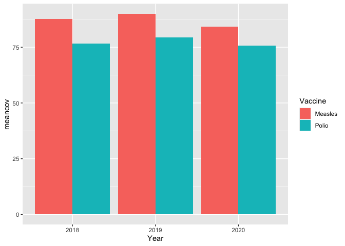

Tidy data and `tidyr::pivot_longer()`
================

- [Background](#background)
- [Examples](#examples)
  - [Example 1: Immunization coverage](#example-1-immunization-coverage)
  - [Example 2: Infections tracking](#example-2-infections-tracking)

# Background

Tidy data principles are crucial in public health data analysis for
ensuring that datasets are structured in a way that facilitates insight
and decision-making. According to the [tidy
data](https://vita.had.co.nz/papers/tidy-data.pdf) concept, each
variable should form a column, each observation should form a row, and
each type of observational unit should form a table. This structure
makes it straightforward to apply various data manipulation and analysis
techniques consistently across different datasets. In the context of
public health, where data often includes multiple measurements over
time, such as vaccination rates, infection counts, or patient outcomes
across different groups and locations, applying tidy data principles
helps in simplifying the data management process. By reformatting data
from wide formats (where multiple observations are in one row) to long
formats (where each row is a single observation), public health
practitioners can more easily perform trend analyses, generate reports,
and build models that inform public health policy and responses. This
approach not only enhances the clarity and accessibility of data but
also supports robust analytical capabilities that are essential for
effective public health interventions.

# Examples

First let’s load the libraries we’ll use in this analysis.

``` r
library(readr)
library(tidyr)
library(dplyr)
library(ggplot2)
```

## Example 1: Immunization coverage

Context: Suppose you have a dataset tracking immunization coverage for
different vaccines across several years in a particular region. The data
is currently in a wide format, where each row represents a region and
each column represents the coverage rate for a specific vaccine in a
specific year.

Objective: Convert this wide format data into a long format to
facilitate easier analysis and visualization of trends over time and
across vaccines.

Here’s the wide data:

``` r
vdat <- read_csv("pivot-data-vaccine.csv")
vdat
```

<div class="kable-table">

| Region | Polio_2018 | Polio_2019 | Measles_2018 | Measles_2019 | Polio_2020 | Measles_2020 |
|:-------|:-----------|:-----------|:-------------|:-------------|:-----------|:-------------|
| North  | 78%        | 81%        | 88%          | 90%          | 77%        | 89%          |
| South  | 72%        | 75%        | 85%          | 87%          | 71%        | 84%          |
| East   | 80%        | 82%        | 90%          | 93%          | 79%        | 80%          |

</div>

We can use the [`pivot_longer()` function from
tidyr](https://tidyr.tidyverse.org/reference/pivot_longer.html) to
reshape this data from wide to long. Let’s also try to parse a numeric
value out of the percentage column, which currently comes through as a
character (string).

``` r
vlong <- 
  vdat |> 
  pivot_longer(cols = -Region, 
               names_to = c("Vaccine", "Year"), 
               names_sep = "_",
               values_to = "Coverage") |> 
  dplyr::mutate(Coverage=parse_number(Coverage))
vlong
```

<div class="kable-table">

| Region | Vaccine | Year | Coverage |
|:-------|:--------|:-----|---------:|
| North  | Polio   | 2018 |       78 |
| North  | Polio   | 2019 |       81 |
| North  | Measles | 2018 |       88 |
| North  | Measles | 2019 |       90 |
| North  | Polio   | 2020 |       77 |
| North  | Measles | 2020 |       89 |
| South  | Polio   | 2018 |       72 |
| South  | Polio   | 2019 |       75 |
| South  | Measles | 2018 |       85 |
| South  | Measles | 2019 |       87 |
| South  | Polio   | 2020 |       71 |
| South  | Measles | 2020 |       84 |
| East   | Polio   | 2018 |       80 |
| East   | Polio   | 2019 |       82 |
| East   | Measles | 2018 |       90 |
| East   | Measles | 2019 |       93 |
| East   | Polio   | 2020 |       79 |
| East   | Measles | 2020 |       80 |

</div>

Now that the data is in a long format, we can do some analysis and
visualization on it.

``` r
# Mean coverage by year
vlong |> 
  group_by(Year) |> 
  summarize(meancov=mean(Coverage))
```

<div class="kable-table">

| Year |  meancov |
|:-----|---------:|
| 2018 | 82.16667 |
| 2019 | 84.66667 |
| 2020 | 80.00000 |

</div>

``` r
# Mean coverage by vaccine by year
vlong |> 
  group_by(Vaccine, Year) |> 
  summarize(meancov=mean(Coverage))
```

<div class="kable-table">

| Vaccine | Year |  meancov |
|:--------|:-----|---------:|
| Measles | 2018 | 87.66667 |
| Measles | 2019 | 90.00000 |
| Measles | 2020 | 84.33333 |
| Polio   | 2018 | 76.66667 |
| Polio   | 2019 | 79.33333 |
| Polio   | 2020 | 75.66667 |

</div>

``` r
# Mean coverage by vaccine by year plot
vlong |> 
  group_by(Vaccine, Year) |> 
  summarize(meancov=mean(Coverage)) |> 
  ggplot(aes(Year, meancov)) + geom_col(aes(fill=Vaccine), position="dodge")
```

<!-- -->

## Example 2: Infections tracking

In this example, imagine that we have been tracking patients over
multiple visits, recording which infectious diseases they may have
tested positive for. The features here (visit and organism) are spread
over multiple columns, making it impossible to do any kind of summary
analysis on this data.

``` r
idat <- read_csv("pivot-data-infections.csv")
idat
```

<div class="kable-table">

| patient | visit_1    | visit_2    | visit_3    | org_1      | org_2 | org_3      |
|:--------|:-----------|:-----------|:-----------|:-----------|:------|:-----------|
| bob     | 2024-04-19 | NA         | NA         | salmonella | NA    | NA         |
| alice   | 2023-04-01 | 2023-12-25 | 2024-03-01 | covid      | flu   | rsv        |
| jon     | 2024-03-04 | 2024-02-28 | NA         | covid      | rsv   | NA         |
| jane    | 2023-12-28 | 2024-01-02 | 2024-03-05 | covid      | flu   | salmonella |
| jim     | 2023-11-19 | 2024-02-15 | NA         | salmonella | rsv   | NA         |

</div>

This format is ideal for analysis as each row clearly defines an event
(a patient visit and the organism identified), making it easier to track
patient progress, treatment efficacy, and infection trends over time.
This method greatly enhances the data’s usability for statistical
testing and graphical representation.

``` r
ilong <- 
  idat |> 
  pivot_longer(
    cols = -patient,
    names_to = c(".value", "Group"),
    names_pattern = "(\\w+)_(\\d+)"
  ) |> 
  filter(!is.na(visit))
ilong
```

<div class="kable-table">

| patient | Group | visit      | org        |
|:--------|:------|:-----------|:-----------|
| bob     | 1     | 2024-04-19 | salmonella |
| alice   | 1     | 2023-04-01 | covid      |
| alice   | 2     | 2023-12-25 | flu        |
| alice   | 3     | 2024-03-01 | rsv        |
| jon     | 1     | 2024-03-04 | covid      |
| jon     | 2     | 2024-02-28 | rsv        |
| jane    | 1     | 2023-12-28 | covid      |
| jane    | 2     | 2024-01-02 | flu        |
| jane    | 3     | 2024-03-05 | salmonella |
| jim     | 1     | 2023-11-19 | salmonella |
| jim     | 2     | 2024-02-15 | rsv        |

</div>

Now we can start to do some analysis.

``` r
# How many visits does each patient have?
ilong |> 
  group_by(patient) |> 
  summarize(n_visits = n())
```

<div class="kable-table">

| patient | n_visits |
|:--------|---------:|
| alice   |        3 |
| bob     |        1 |
| jane    |        3 |
| jim     |        2 |
| jon     |        2 |

</div>

``` r
# How many distinct patients has each organism been found in?
ilong |> 
  group_by(org) |> 
  summarize(n_patients = n_distinct(patient))
```

<div class="kable-table">

| org        | n_patients |
|:-----------|-----------:|
| covid      |          3 |
| flu        |          2 |
| rsv        |          3 |
| salmonella |          3 |

</div>

``` r
# What are the earliest and latest dates we have in our data?
ilong |> 
  summarize(start=min(visit), end=max(visit))
```

<div class="kable-table">

| start      | end        |
|:-----------|:-----------|
| 2023-04-01 | 2024-04-19 |

</div>
